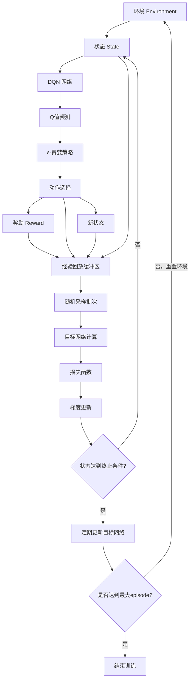

# DQN (Deep Q-Network) 学习笔记

## 1 DQN 核心概念

### 1.1 DQN 简介
DQN（Deep Q-Network）是结合深度学习和强化学习的算法，用于解决高维状态空间的强化学习问题。它通过使用深度神经网络来近似 Q 函数，从而能够处理复杂的环境。

### 1.2 DQN 结构
DQN 的基本结构包括以下几个部分：
1. **输入层**：接收环境的状态信息，通常是图像数据或其他特征表示。
2. **卷积层**：通过卷积操作提取输入数据的空间特征。
3. **全连接层**：将卷积层提取的特征映射到 Q 值空间。
4. **输出层**：输出每个动作的 Q 值，用于选择最优动作。
5. 
### 1.3 DQN 核心概念
- **Q值**：表示在给定状态下采取某个动作的预期回报。
- **ε-贪婪策略**：在训练过程中，智能体以 ε 的概率随机选择动作，以探索环境；以 1-ε 的概率选择当前 Q 值最大的动作，以利用已学知识。
- **经验回放**：将智能体的经历存储在经验池中，并从中随机采样进行训练，以打破数据之间的相关性，提高训练稳定性。
- **目标网络**：使用一个固定的目标网络来计算 Q 值，定期将主网络的参数复制到目标网络，以提高训练的稳定性。
- **损失函数**：通过最小化 Q 值的均方误差来更新网络参数，通常使用 Bellman 方程来计算目标 Q 值
- **梯度更新**：使用反向传播算法来更新神经网络的权重。

### 1.4 DQN 训练过程
DQN 的训练过程主要包括以下几个步骤：
1. **经验回放**：将智能体的经历（状态、动作、奖励、下一个状态）存储到经验池中。
2. **随机采样**：从经验池中随机采样一批经历，用于训练。
3. **目标网络**：使用目标网络计算 Q 值，目标网络的参数定期更新，以提高训练稳定性。
4. **损失函数**：通过最小化 Q 值的均方误差来更新网络参数。

### 1.5 DQN 算法结构


## 2 DQN 损失函数详解

### 2.1 损失函数公式

DQN 使用均方误差（MSE）作为损失函数：

```
Loss = E[(Q_target - Q_predicted)²]
```

其中：
- **Q_predicted**: 主网络预测的 Q 值
- **Q_target**: 目标 Q 值（基于 Bellman 方程计算）

### 2.2 目标 Q 值计算

```mermaid
graph TD
    A[当前状态 s] --> B[执行动作 a]
    B --> C[获得奖励 r]
    B --> D[到达新状态 s']
    C --> E[目标Q值计算]
    D --> F[目标网络预测 Q_target_net]
    F --> G[max Q_target_net(s', a')]
    G --> E
    E --> H[Q_target = r + γ × max Q_target_net(s', a')]
    
    style E fill:#ff9999
    style H fill:#99ccff
```

### 2.3 具体计算步骤

**第一步：从经验池采样**
```
batch = [(s₁, a₁, r₁, s₁'), (s₂, a₂, r₂, s₂'), ..., (sₙ, aₙ, rₙ, sₙ')]
```

**第二步：计算当前 Q 值**
```
Q_predicted = MainNetwork(s)[a]  # 主网络对当前状态-动作的Q值预测
```

**第三步：计算目标 Q 值**
```
if episode_done:
    Q_target = reward
else:
    Q_target = reward + γ × max(TargetNetwork(s_next))
```

**第四步：计算损失**
```
Loss = (Q_target - Q_predicted)²
```

### 2.4 损失函数计算流程图

```mermaid
flowchart TD
    A[经验池采样] --> B[批次数据]
    B --> C[主网络前向传播]
    B --> D[目标网络前向传播]
    
    C --> E[Q_predicted = Q_main(s,a)]
    D --> F[Q_next_max = max Q_target(s')]
    
    F --> G[判断是否终止状态]
    G -->|是| H[Q_target = reward]
    G -->|否| I[Q_target = reward + γ × Q_next_max]
    
    H --> J[计算 TD 误差]
    I --> J
    E --> J
    
    J --> K[Loss = (Q_target - Q_predicted)²]
    K --> L[反向传播更新主网络]
    
    style K fill:#ffcc99
    style L fill:#99ffcc
```

### 2.5 代码实现示例

```python
def compute_loss(self, batch):
    states, actions, rewards, next_states, dones = batch
    
    # 主网络预测当前状态的Q值
    current_q_values = self.main_network(states).gather(1, actions.unsqueeze(1))
    
    # 目标网络预测下一状态的最大Q值
    next_q_values = self.target_network(next_states).max(1)[0].detach()
    
    # 计算目标Q值
    target_q_values = rewards + (self.gamma * next_q_values * (1 - dones))
    
    # 计算损失
    loss = F.mse_loss(current_q_values.squeeze(), target_q_values)
    
    return loss
```

### 2.6 TD 误差的意义

**TD 误差（Temporal Difference Error）**：
```
TD_error = Q_target - Q_predicted
```
- TD_error > 0：表示当前 Q 值低于目标 Q 值，网络需要增加对该动作的估计。
- TD_error < 0：表示当前 Q 值高于目标 Q 值，网络需要减少对该动作的估计。
- TD_error = 0：表示当前 Q 值与目标 Q 值一致，网络不需要更新。

### 2.7 为什么使用目标网络？

目标网络的引入是为了提高 DQN 的训练稳定性。主网络在训练过程中会频繁更新，而目标网络则保持相对稳定，定期将主网络的参数复制到目标网络中。这种方式可以减少 Q 值估计的波动，使得训练过程更加平滑。

**关键点：**
1. **双网络结构** 避免了"追逐移动目标"的问题
2. **固定目标** 让训练过程更加稳定
3. **定期更新** 确保目标网络跟上主网络的学习进度
4. **TD学习** 通过时序差分来逐步改进Q值估计

这种损失函数设计使得 DQN 能够稳定地学习最优的 Q 函数，从而找到最优策略。